# Laboratório de Redes de Comunicação (ST568) - WIRESHARK
### Renato de Castro Ferreira - r187770@dac.unicamp.br - FT/Unicamp
### André Leon S. Gradvohl - gradvohl@unicamp.br - FT/Unicamp

## INSTALAÇÃO DO WIRESHARK
### Windows
O Wireshark pode ser baixado diretamente pelo site da Wireshark Foundation.

Acesse [https://www.wireshark.org/download.html](https://www.wireshark.org/download.html) e, dentro de "Stable Release", clique na versão compatível com o seu sistema: "Windows Installer (64-bit)" ou "Windows Installer (32-bit)".

Abra o arquivo baixado **.exe**. 

Antes de iniciar a instalação, o Windows irá perguntar de "Deseja permitir que este aplicativo faça alterações em seu dispositivo?". Caso o nome do aplicativo seja *Wireshark installer* e o fornecedor *Wireshark Foundation, Inc.*, clique em *Sim*.

Ao abrir o inicializador:
1. Uma tela de boas vindas surgirá, clique em "*Next*";

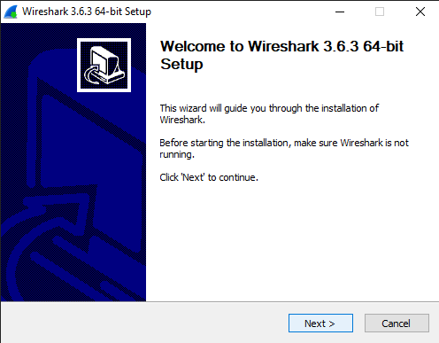

2. Em "*License Agreement*", clique em "*Noted*";

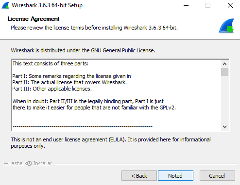

3.  Em "*Choose Components*", verifique se todos os componentes estão selecionados e clique em "*Next*";

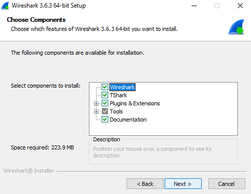

4. Em "*Additional Tasks*":
	1. Em "*Create Shortcuts*", selecione os itens de acordo com sua preferência;
	2. Em "*Associate File Extensions*", selecione a opção "*Associate trace file extensions with Wireshark*".

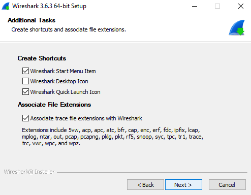

5. Em "*Choose Install Location*", clique em "*Next*";

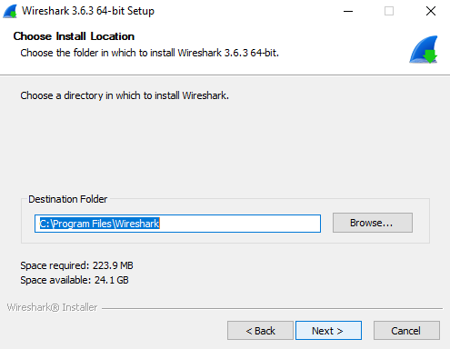

6. Em "*Packet Capture*", verifique se "*Install Npcap (versão)*" está selecionado e clique em "*Next*";

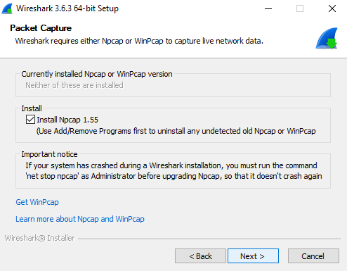

7. Em "*USB Capture*", verifique se "*USBPcap (versão)*" não está selecionado e clique em "*Next*" (não iremos utilizá-lo nesta aula, mas pode instalá-lo caso tenha a curiosidade de analisar o tráfego das portas USB);

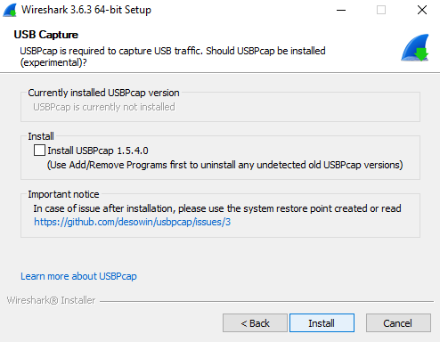

8. Aguarde a instalação do programa;
9. Uma janela de instalação no Npcap irá abrir;
10. Em "*License Agreement*", clique em "*I Agree*";

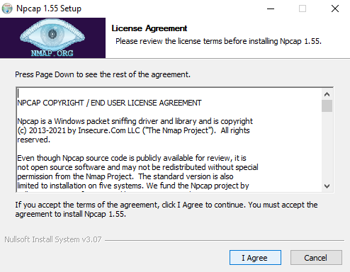

11. Em "*Installation Options*" deixe tudo não selecionado (mas pode clicar em "*Support raw 802.11 traffic*" caso tenha a curiosidade de capturar e analisar o cabeçalho Wi-Fi);

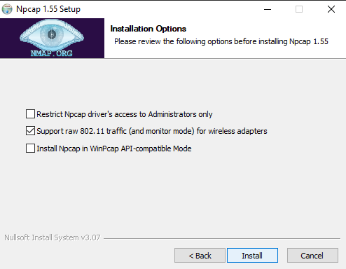

12. Aguarde a instalação do Npcap, quando "*Installation Complete*" aparecer, clique em "*Next*";

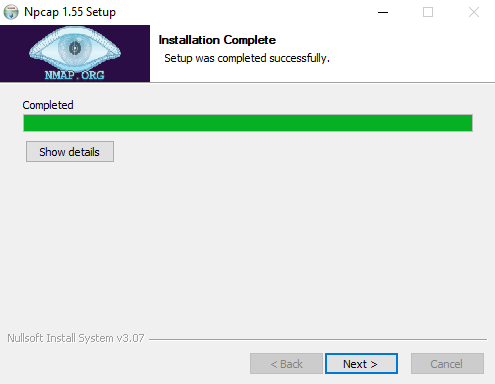

13. Em "*Finished*", clique em "*Finish*". A instalação no Npcap irá fechar, e a instalação do Wireshark, continuar;

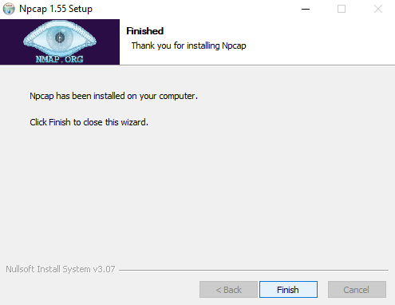

14. Em "*Installation Complete*", clique em "*Next*";

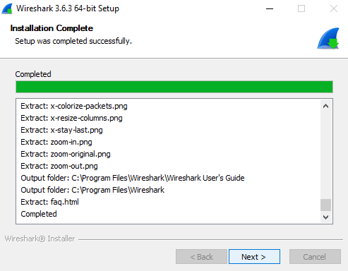

15. Em "*Completing Wireshark (...) Setup*, clique em "*Finish*". O instalador irá se fechar;

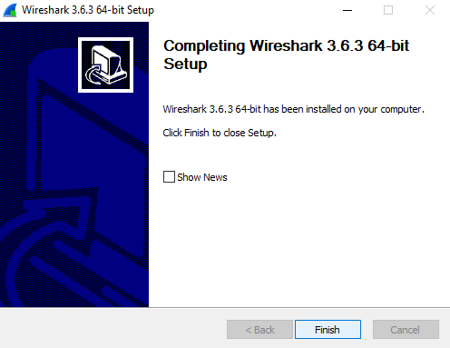

16. Verifique se o programa foi instalado corretamente.

### Linux
Por padrão, a grande maioria dos sistemas Linux contam com o Wireshark em seus repositórios. A instalação é muito simples de ser feita e necessita apenas do uso do terminal como um superusuário.

Para instalá-lo em sistemas baseados em **Debian e Ubuntu**, copie e cole o comando abaixo em seu terminal:
~~~
sudo apt update && sudo apt install wireshark
~~~

Durante a instalação, uma tela chamada "Configuring wireshark-common" poderá aparecer. Dê enter na primeira janela e, na segunda tela, utilize as setas direcionais para selecionar "Yes" e dê enter. Com essa configuração cria-se um grupo no sistema denominado "wireshark" o qual permite que não super-usuários membros possam visualizar as interfaces de rede.

Para instalá-lo em sistemas baseados em **RedHat (como o Fedora)**, copie e cole o comando abaixo em seu terminal:
~~~
sudo dnf install wireshark
~~~

Para instalá-lo em sistemas baseados em **ArchLinux,** copie e cole o comando abaixo em seu terminal:
~~~
sudo pacman -S wireshark-gtk
~~~

**Após a instalação** do Wireshark, é necessário adcionar o seu usuário ao grupo "wireshark" para que não seja necessário utilizar o programa como um superusuário. Abra o terminal e digite o comando:
~~~
sudo usermod -a -G wireshark nome_do_seu_usuário
~~~

## CONHECENDO O SOFTWARE
### Capturando pacotes

#### Iniciando a captura
Ao iniciar o Wireshark, uma tela de boas-vindas lista as conexões de rede disponíveis em seu dispositivo atual. À direita de cada interface de rede, existe um gráfico que indica a qual utilização da interface ao vivo. 

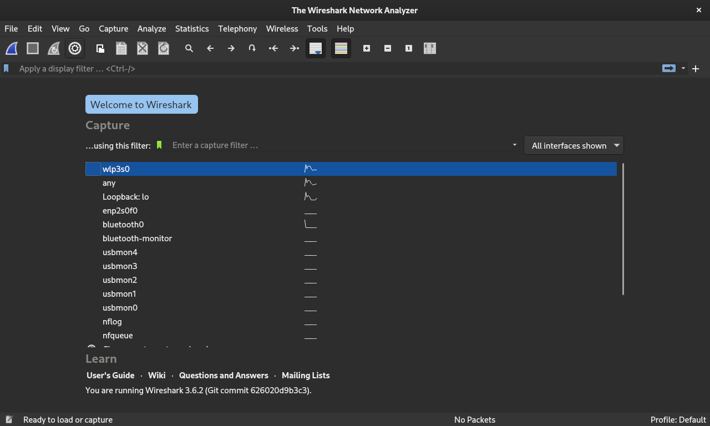

Para capturar o tráfego de uma ou mais interfaces, selecione as interfaces desejadas e pressione **Ctrl + E**.

#### Parando a captura
Para parar a captura, pressione **Ctrl + E**. Ou vá para a barra de ferramentas do Wireshark e selecione o botão quadrado e vermelho que está localizado próximo à barbatana de tubarão azul, no canto superiro direito.

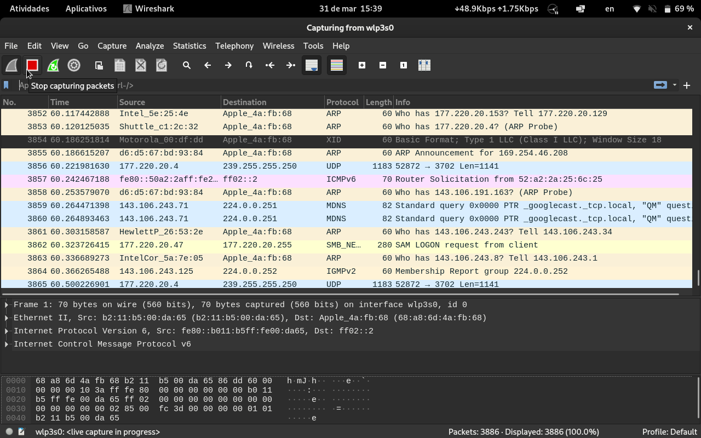

#### Salvando e exportando a captura
Para salvar a captura, no menu superior direito, vá em **File > Save** ou pressione **Ctrl + S**. 
Caso prefira fazer a exportação de elementos específicos da captura, utilize as opções de exportação encontradas em  **File > Export...**.

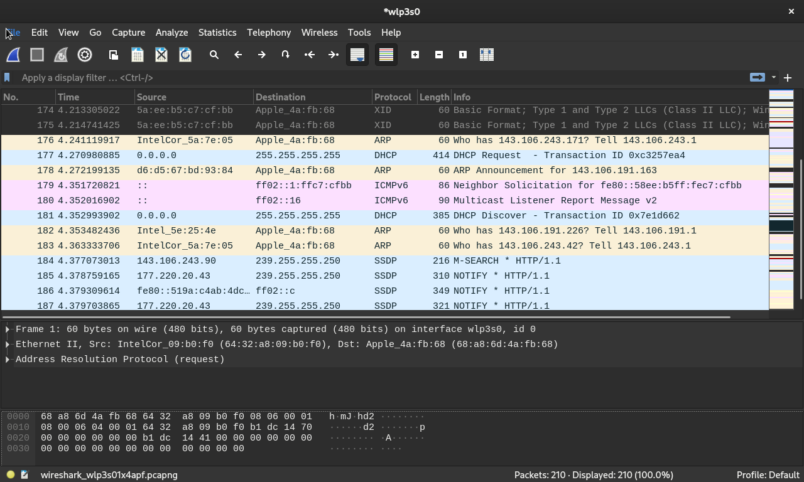

### Analisando os pacotes capturados
#### A interface de captura
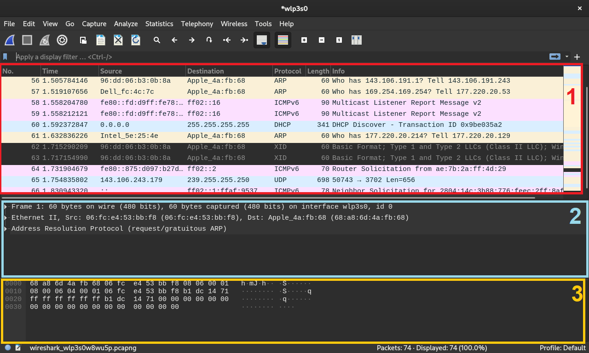

A interface de dados capturados é composto por três seções:
1. O painel da lista de pacotes
2. O painel de detalhes do pacote
3. O painel de bytes do pacote

##### Lista de pacotes
Esse painel mostra todos os pacotes encontrados no arquivo de captura ativo. Cada linha corresponde a um pacote e as colunas, por padrão estão organizadas, da esquerda para a direita, em:
- **Número (No.)**: apresenta o número do pacote (os pacotes são numerados na ordem de chegada à interface) e, quando um pacote é selecionado, símbolos aparecem. Colchetes abertos ou fechados e uma linha horizontal reta indicam se um pacote ou grupo de pacotes faz parte da mesma conversa de ida e volta na rede; uma linha horizontal interrompida significa que o pacote não faz parte da conversa;
- **Tempo (Time)**: exibe em que momento o pacote foi capturado, com o referencial no início da captura. A unidade é dada em segundos parciais;
- **Fonte (Source)**: exibe o endereço (em geral IP ou MAC) a partir do qual o pacote foi originado;
- **Destino (Destination)**: exibe o endereço (em geral IP ou MAC) para onde o pacote foi enviado;
- **Protocolo (Protocol)**: exibe o nome do protocolo do pacote (em geral o Wireshark exibe o protocolo de Layer mais alta que ele consegue identificar);
- **Comprimento (Length)**: exibe o comprimeito do pacote em bytes;
- **Informações (Info)**: exibe detalhes adcionais do pacote, sendo que seu conteúdo varia demasiadamente a depender do conteúdo do pacote.

Caso queira alterar a unidade da coluna **Tempo (Time)**, selecione **View > Time Display Format > ...** 

##### Detalhes do pacote
Esse painel apresenta os protocolos e campos de protocolo do pacote selecionado, organizados em seções expandíveis do primeiro ao último header. Aqui, filtros Wireshark individuais podem ser aplicados com base em detalhes específicos e fluxos de dados podem ser seguidos com base no tipo de protocolo, clicando com o botão direito do mouse no item desejado.

##### Bytes do pacote
Esse painel apresenta os dados brutos do pacote selecionado em bytes no formato hexadecimal. Esse dump hexadecimal contém 16 bytes hexadecimais e 16 bytes ASCII junto com o deslocamento de dados. A seleção de uma parte específica desse pacote (tanto no formado hexadecimal quanto no ASCII) destaca automaticamente sua seção correspondente no painel de detalhes do pacote e vice-versa. Todo byte que não possui correspondente no código ASCII é representado por um ponto.

#### Filtros

No Wireshark existem dois tipos de filtros:
1. **Filtro de exibição**: está presente tanto na tela de boas vindas quanto na tela de análise dos pacotes. Ele serve para filtrar os pacotes previamente capturados e exibir apenas os solicitados. Para aplicá-lo, basta digitar o nome do filtro no campo "*Apply a display filter*", localizado logo abaixo da barra de ferramentas.
2. **Filtro de captura**: está presente apenas na tela de boas vindas. Ele serve para que o Wireshark capture apenas os pacotes correspondentes ao filtro. Para aplicá-lo, basta digitar o nome do filtro no campo "*Enter a capture filter*", localizado dentro da tela de boas vindas e antes das interfaces de captura. Esse tipo de filtro não pode ser modificado após a captura ser iniciada!

Em qualquer um dos dois campos de inserção de filtros existe o recurso de preenchimento automático, o qual sugere nomes de filtros a medida que é digitado.

Caso tenha a necessidade de utilizar um mesmo filtro em várias capturas, é possível salvar e editar filtros pré-definidos para que não seja necessário adcionar a expressão manualmente. Tais filtros podem ser encontrados no símbolo de bandeirola ao lado dos campos de digitação dos filtros. Para adcionar, excluir ou editar estes filtros, clique na bandeirola e, em seguida, em *Manage Display Filters* ou *Manage Capture Filters*.

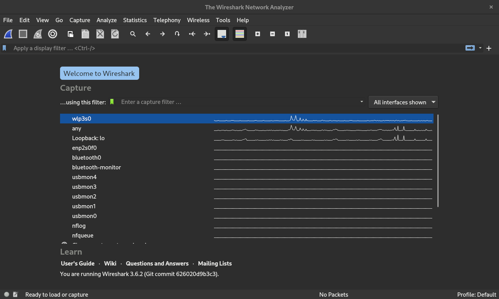

##### Alguns filtros muito utilizados
- **IP de origem**: *ip.src==o.endereço.desejado.aqui*
- **IP de destino**: *ip.src==o.endereço.desejado.aqui*
- **Endereço IP**: *ip.addr==o.endereço.desejado.aqui*
- **Método de requisição HTTP**: *http.request.method=="metodo_desejado"*
- **URI**: *http.request.uri=="/a/uri/do/site.html*
- **Porta TCP**: *tcp.port==123456*
- **Flag TCP**: *tcp.flags*
- **Porta UDP**: *udp.port==123456* 
- **ARP**: *arp*
- **Ignorar ARP**: *!arp*
- **ICMP**: *icmp*
- **Ignorar ICMP**: *!icmp*

#### Regras de cores
Além de filtros de captura e exibição, o Wireshark também possui regras de cores para poder distinguir diferentes pacotes. Tal esquema de cores facilita a visualização de um conjunto de pacotes para que seja possível diagnosticar problemas na rede mais rapidamente.

Por padrão existem 20 regras de cores no Wireshark, mas esse é um recurso totalmente modificável, sendo possível adcionar, excluir e editar regras para melhorar a visualização. Para isso, vá para **View > Coloring rules...** 

Para habilitar e desabilitar o recurso, vá para **View > Colorize Packet List**.

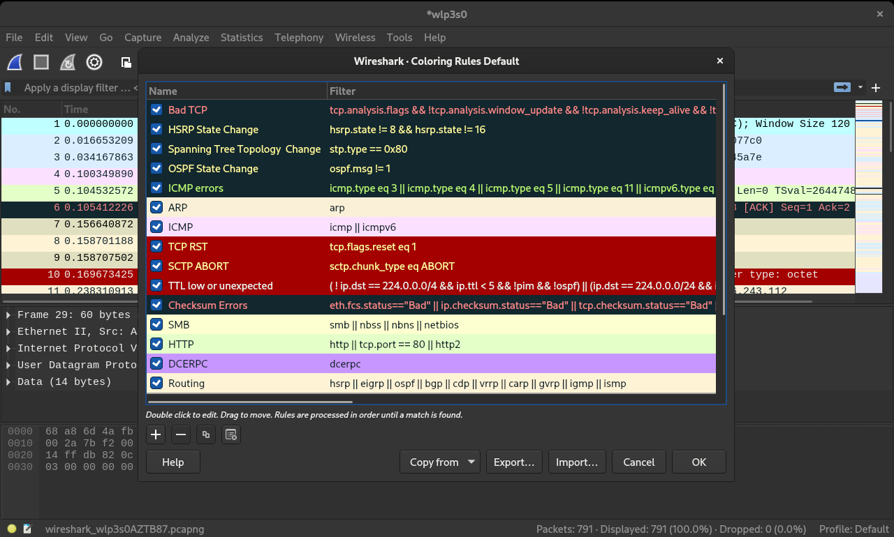

Por padrão, o background de pacotes UDP é azul claro, enquanto que o de pacotes TCP é roxo claro. Fique atento aos pacotes com background em preto, pois eles indicam erros ou mudanças na rede!

#### Estatísticas de rede
Métricas sobre a rede estão disponíveis no menu **Statistics**. Ele traz várias métricas que vão desde informações sobre tempo e tamanho até representações gráficas. Também é possível aplicar filtros de exibição a essas estatísticas para poder exibir apenas informações sobre o tráfego relevante.

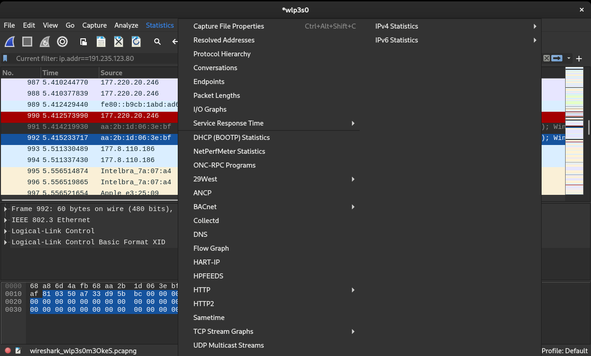

Aqui estão alguns exemplos de estatísticas:
- **Protocol Hierarchy**: retorna uma janela com uma tabela de todos os protocolos capturados. Caso algum filtro de exibição esteja ativo, ele será referenciado na parte de baixo da janela;
- **Conversations**: mostra estatísticas sobre a conversa entre dois computadores quaisquer;
- **Endpoint**: mostra uma lista de endereços presentes na captura e suas estatísticas. Em endereços Ethernet, é possível ativar o "*Name resolution*" para descobrir qual a fabricante do dispositivo (ou placa de rede). Em endereços IP, além das estatísticas relacionadas ao envio e recebimento de pacotes, também existem informações relacionadas ao GeoIP (em que país e cidade se encontra o dispositivo) e ao Autonomous System (identificação do "dono" do endereço IP - [mais informações disponíveis aqui](https://www.cloudflare.com/pt-br/learning/network-layer/what-is-an-autonomous-system/));
- **IO Graphs**: exibe um gráfico dos pacotes durante a captura. O conteúdo do gráfico é totalmente personalizável, sendo possível adcionar várias séries de dados (com o uso de filtros de exibição), escolher o tipo de gráfico para cada série (linha, barra, impulso, pontos), eixos, entre outros;
- **Service Response Time**: exibe o tempo de resposta entre a solicitação e a resposta da rede (funciona apenas para alguns prococolos específicos como SCSI, SMB, SMB2, RADUIS LDAP...);
- **DNS**: retorna uma janela com uma tabela com estatísticas acerca do DNS.

Além do menu **Statistics**, existe um menu separado chamado **Telephony**, o qual traz estatísticas relacionadas à protocolos puramente de telefonia (a exemplo dos submenus VoIP, GSM, LTE e SIP), como também outros que também são utilizados em streams multimídia, como transmissões de IPTV ou videochamadas (a exemplo dos submenus RTP e RTSP).

### Amostras de capturas
Nesse laboratório você irá realizar uma captura a partir de sua própria máquina mas, caso queira se divertir analisando capturas com protocolos que dificilmente aparecerão em sua rede doméstica (como GSM, UTMS ou STP), é possível encontrá-las na [própria Wiki do Wireshark](https://wiki.wireshark.org/SampleCaptures#sample-captures).

## ENTENDENDO A DIFERENÇA ENTRE HTTP E HTTPS
Nesse laboratório, será necessário bootar o Windows caso utilize os computadores da informática.

Iremos acessar um site com uma página de login que passa as credenciais do usuário ao servidor via texto simples, ou seja, a proteção dos dados de autenticação depende única e exclusivamente da criptografia TLS da camada 6 (apresentação) do modelo OSI.

Passos para a execução do laboratório:
1. Abra o Wireshark e o navegador web de sua preferência;
2. Em vista de facilitar a visualização dos dados, utilize filtros de captura para limitá-la ao protocolo **TCP** nas portas **80** e **443**. O site pode ser fornecido por dois endereços IP: **104.21.62.150** e **172.67.136.182**;
3. Inicie a captura de pacotes;
4. Acesse o site seguro **https://st568.l4ti.net.br**;
5. No campo *usuário*, digite **labredes** e, no campo *senha*, digite **senhaforte**;
6. Clique em login e espere a página carregar;
7. Pare a captura e analise os pacotes. Você verá que não é sequer possível descobrir se a aplicação usada foi mesmo HTTP, pois o Wireshark não consegue compreender nada após o header TLS devido à criptografia;
8. Reinicie a captura e siga novamente os passos, porém agora acessando a versão não segura do site: **http://st568.l4ti.net.br**;
9. Dentre os pacotes nos quais o servidor é o destino, será possível visualizar as credenciais de login.
